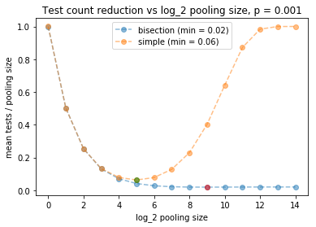

# Sample pooling to reduce needed disease screening test counts

Pooling of test samples can be used to reduce the mean number of test counts
required to determine who in a set of subjects carries a disease. E.g., if the
blood samples of a set of office workers are combined and tested, and the test
comes back negative, then the full office can be ruled out as disease carriers
using just a single test (whereas the naive approach would require testing each
separately).  However, if the test comes back positive, then a refined search
through the workers must be carried out to decide which have the disease and
which do not.

Here, we consider two methods for refined search when a group is flagged
positive, and provide python code that can be used to find the optimal pooling
strategy.  This depends on the frequency of disease within the testing
population, .

Impact summary of pooling concept: 
 - If ,
   so that many people have the illness, pooling doesn't help. 
 - If ,
   perhaps typical of people being screened with symptoms, we can
   reduce the test count needed to about 0.6 per person using pooling, and the two refined
search methods we consider perform similarly here.
 - If ,
   so that positive cases are rare -- perhaps useful for
   screening an office of workers expected to be healthy, then we can cut the
mean test count needed to about 0.02 per person, a 50-fold reduction.  In this case, the bisection method for refined search performs best (details below).


External references:
 - An Israeli group that tried this confirmed it would work with swab tests for
   Covid19 using pools up to size 64 (<a href="https://www.timesofisrael.com/to-ease-global-virus-test-bottleneck-israeli-scientists-suggest-pooling-samples/">link</a>).

 - Wikipedia on group testing (<a href="https://en.wikipedia.org/wiki/Group_testing">link</a>)

 - NYT article that states that some German hospitals are using the idea (<a href="https://www.nytimes.com/2020/04/04/world/europe/germany-coronavirus-death-rate.html">link</a>)

Code for this analysis can be found in the ipynb included in this repo.

### **COVID19 background, strategies considered here**
The idea of pooling is an old one, but I happened on the idea when an article
was posted about it to the statistics subreddit this past week (<a
href="https://www.reddit.com/r/statistics/comments/fl3dlw/q_if_you_could_test_batches_of_64_samples_for/">link</a>).
This post references the Israeli article noted above and posed the question of
what the optimal pooling count would be -- motivating this post.

I imagine pooling may be useful for COVID19 under two conditions:  (1)
situations where testing capactity is the limiting factor (as opposed to speed
of diagnosis, say), and (2) Situations where a great many people need to be
screened and it is unlikely that any of them have it -- e.g., daily tests
within a large office buiding.

We consider two pooling methods here:  (1) A simple method where if the test
on the group comes back positive, we immediately screen each individual.  (2) A
bisection method, where if a group comes back positive, we split it in two and
run the test on each subgroup, repeating from there recursively.  E.g., in a
group of size 16 with one positive, the recursive approach generates the following
set of test subsets (see notebook)
```python
seq = generate_random_seq()
test_counts_needed.append(test_count(seq))
total size = 16
[0, 0, 0, 0, 0, 0, 0, 0, 0, 0, 0, 0, 1, 0, 0, 0]
[0, 0, 0, 0, 0, 0, 0, 0]
[0, 0, 0, 0, 1, 0, 0, 0]
[0, 0, 0, 0]
[1, 0, 0, 0]
[1, 0]
[1]
[0]
[0, 0]
``` 
Here, the 13th individual had the disease, and the bisection method required a
total of 9 tests (one for each row above) to determine the full set of diagnoses.  Note that
9 is less than 16, the number needed when we screen everyone from the start.

Our purpose is to provide code and equations that can be used to select from these two
methods should anyone want to apply this idea.  Caveat:  We currently ignore
any possibility of error in the tests.  This may make the approach invalid for
some or all of the current covid19 tests.  Error rates should be studied next
where appropriate.

### **Model and results**

We posit that we have a pool of

,

people to be tested.  In the first round, we pool all their samples and test the
group.  If the group comes back positive, we then run one of the refined methods to
figure out which people exactly have the illness.  Each person is supposed to have a probability
 of having the disease.
Below, we ask how to set  -- which determines the pooling size --
so as to minimize the mean number of tests needed divided by , which can be
considered the pooling reduction factor.

The mean number of tests needed from the simple strategy is

,

The mean number needed in the bisection strategy is

,

The proof of the first result above is straightforward and we give an argument for
the second in an appendix. A cell of our notebook checks this and confirms its accuracy.

Using the above results, our code produces plots of the mean number of tests
needed to screen a population vs .
This then finds the optimal number for each type.  The plots below give the results for the three  values noted in the abstract.

- Case 1: , large fraction of disease carriers.  Main result: The
pooling strategies both cause the mean number of tests to be larger than if
we just screened each individual from the start (seen here because the y-axis
values are always bigger than 1).  The approach is not useful here.


- Case 2: , modest fraction of disease carriers.  Main result: The two
methods both give comparable benefits.  It is optimal to pool using , which gives groups of  patients. This cuts the number of needed tests per sample to 0.6.


- Case 3: , small fraction of disease carriers.  Main result:
Bisection wins, the optimal  here, which gives a pooling
group of size 512.  We cut the test count needed by a factor of 50.  Note:
We also show here a histogram showing the number of tests needed when we run a
simulated system like this.  We see that we often only need one test, and there
is another peak around 20 tests, with some structure after that. 




The code to generate the optimal  plots above is given below.  This
can be used to generate generalized plots like those above for any . The
histogram plot is contained in the included ipynb.  Our appendix follows.

```python
import numpy as np
%pylab inline

K = 5
P_POSITIVE = 0.05

def theory_bisection(p=P_POSITIVE, K=K):
    count = 1 + 2 * np.sum([2 ** k * (1 - (1 - p) ** (2 ** (K - k))) for k in range(K)] )
    return count / 2 ** K

def theory_simple(p=P_POSITIVE, K=K):
    n = 2 ** K
    p0 = (1 - p) ** n
    count = 1 * p0 + (1 + n) * (1 - p0)
    return count / n

print 'Bisection: fraction of full testing: %2.2f' % (theory_bisection())
print 'Simple: fraction of full testing: %2.2f' % (theory_simple())

p = 0.1
data = [theory_bisection(p, k) for k in range(15)]
min_index = np.argmin(data)
plot(data, 'o--', label='bisection (min = %2.2f)'%data[min_index], alpha=0.5)
plot(min_index, data[min_index], 'ro',alpha=0.5)

data = [theory_simple(p, k) for k in range(15)]
min_index = np.argmin(data)
plot(data, 'o--', label='simple (min = %2.2f)'%data[min_index],alpha=0.5)
plot(min_index, data[min_index], 'go',alpha=0.5)
plt.legend()
plt.title('Test count reduction vs log_2 pooling size, p = %0.3f' %p)
plt.xlabel('log_2 pooling size')
plt.ylabel('mean tests / pooling size')
```


### **Appendix: Derivation of bisection result**
Consider a binary tree with the root node being the initial test. Each node
has two children that correspond to the tests of the two subgroups for a given
test.  We must test these if the parent is positive.  Level 0 is the initial
test and k rows down we call the level k of tests.  There are total of  posible tests to run at this level, and there are a total of  levels.

The number of tests that need to be run at level k is set by the number of
positive tests at level k-1.  We have


If we average this, we just get the number of tests at level k times the probability any given test is positive at that level. This gives


This is the result shown above.
